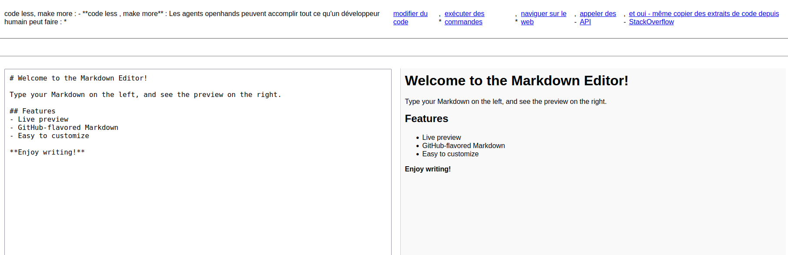

# InkShell — Markdown Meets REPL

* InkShell is a browser-based Markdown editor with REPL-style code simulation and file-saving capabilities. It’s designed for developers who want to write documentation, test code snippets, and kickstart their projects—all in one elegant interface.
✨ Features

    📝 Live Markdown Editor — Write and preview Markdown in real time

    💾 Save Markdown Files — Download your content as .md files locally

    🐍 Python3 REPL Simulation — Run Python code blocks using 

    💎 Ruby IRB-style Prompt — Simulate Ruby sessions (via optional Opal integration)

    🧠 Start Your Repo from the Browser — Type code as if you're in python3 or irb

    🌐 Frontend-Only or Fullstack — Use standalone HTML or connect to a backend for persistence

🛠 Tech Stack
Layer	Technology	Purpose
Frontend	HTML, CSS, JS	Markdown editor + REPL UI
Markdown	
Markdown parsing and rendering
Python REPL	Pyodide	In-browser Python execution
Ruby REPL	Opal (optional)	Ruby-to-JS transpilation
Backend	Python (FastAPI)	Save/load Markdown files, manage sessions
Storage	SQLite / FileSystem	Store markdown content and history


 * comment vas t-u
````
sudo apt install markdown discount
vi README.md #write something
mkd2html "README.md" "readme"


````
* do
````
sudo apt install markdown discount
vi README.md #write something
mkd2html "README.md" "readme"
python -m venv tutorial-env
source tutorial-env/bin/activate
flask run --host=0.0.0.0
#for ruby
irb
Kernel.at_exit {
  File.open("irb.log", "w") do |f|
    f << Readline::HISTORY.to_a.join("\n")
  end
}

````
* When you exit IRB the input history will be saved to irb.log in your current working directory. It will also work if you’ve already run some commands and then paste the above block.
* Here is a quick solution: Create .irbrc file in your home directory and paste following line into it: IRB.conf[:SAVE_HISTORY] = 1000
- for python3
````
import readline
readline.write_history_file('python_history.txt')
````
🧩 Notes & Tips

    When writing content: → Start your keywords in the title, end them in the body. → Replace shapes (square, circle, triangle) with emojis of your choice.

    For data logging: → Fill your table once per GPS position, datetime, and full dataset.

🧭 README Focus

Start by choosing your direction:  Frontend (HTML) or Backend (Python/Ruby).
-  ce n’est pas pour faire llm from scratch , ou commencer un nouveau voyage depuis zéro.  Tu es pas un developpeur du début, 

- **code less , make more** : Les agents openhands peuvent accomplir tout ce qu'un développeur humain peut faire : modifier du code, exécuter des commandes, naviguer sur le web, appeler des API, et oui - même copier des extraits de code depuis StackOverflow.
- flask --app . init-db
- flask --app . run

 
